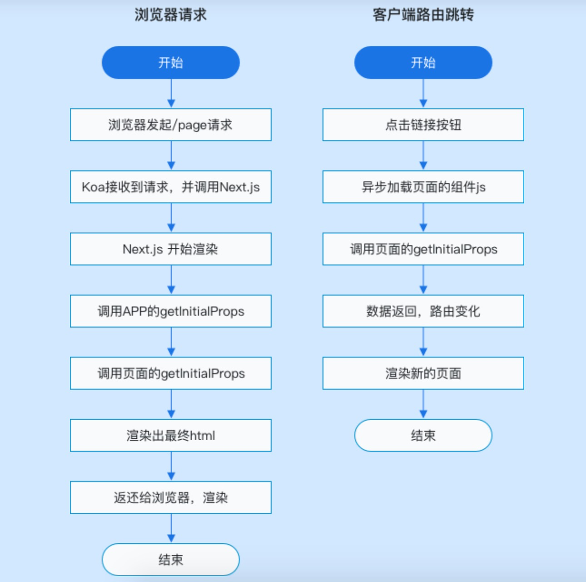

# 教你玩转react、next、hooks 、koa、antd


#### 前言
以下文章纯属个人理解，便于记录学习，肯定有理解错误或理解不到位的地方，
意在站在前辈的肩膀，分享个人对技术的通俗理解，共同成长！

> Next.js 是一个轻量级的 React 服务端渲染应用框架。

> 官方网站：https://nextjs.org  

> 中文官网：https://nextjs.frontendx.cn

> API: https://developer.github.com/apps/building-oauth-apps/authorizing-oauth-apps/

`当使用 React 开发系统的时候，常常需要配置很多繁琐的参数，如 Webpack 配置、Router 配置和服务器配置等。
如果需要做 SEO，要考虑的事情就更多了，怎么让服务端渲染和客户端渲染保持一致是一件很麻烦的事情，
需要引入很多第三方库。针对这些问题，Next.js 提供了一个很好的解决方案，使开发人员可以将精力放在业务上，
从繁琐的配置中解放出来。下面我们一起来从零开始搭建一个完善的 next 项目`

> Author:君吟

> Email: 506499594@qq.com  

> github: https://github.com/zmj0920/


#### 运行
```
npm run dev

```

#### 目录结构
```
├── components           非页面级共用组件
│   └── Layout.jsx       路由配置文件
├── lib                  一些通用的js
│   └── with-redux.js    继承redux
├── pages                页面级组件 会被解析成路由
│   └── _app.js          自定义 app配置
│   └── _document.js     自定义 document 配置
│   └── index.js         首页
├── server               服务端文件
│   └── auth.js          github auth 授权
│   └── session-store.js 使用redis缓存store 
├── static               静态资源
├── store                redux使用相关文件
├── test                 测试文件 
├── babelrc              babel 编译配置
├── gitignore            git不需要上传文件配置
├── next.config.js       next 相关配置
├── package.json         项目依赖配置文件
├── README.md            项目说明文件
├── server.js            服务端文件
```


对现有模式的影响
最新的redux将不需要使用connect来连接组件，而是在组件中直接使用redux提供的hooks。这对于使用redux的大型应用来说是一种非常好的提升，因为现在可以实际创建自定义的可重用hooks，而无需额外的container组件。到目前为止，我们无法创建一个hooks来从redux中读取state或者dispatch actions。因此，借助自定义hooks封装redux相关的逻辑，react将不需要直接引用redux。

并且redux提供的hooks让我们不再需要使用mapStateToProps，mapDispatchToProps和connect来维护单独的container组件和UI组件，可以立即在function组件内部读取redux中的state。此外，还可以将任何现有的自定义hooks与redux集成，而不是将通过hooks创建的state，作为参数传递给其他hooks，相当于把这块的逻辑完全抽取出去了，让我们编写的组件更纯净。


```
// 以前
import React from 'react';
import { connect } from 'react-redux';
 
const Component = props => <div title={props.title}>{props.content}</div>;
 
export default connect(state => ({
  title: state.title, 
  content: state.content
}))(Component)

```

```
// 使用redux hooks
import React from 'react';
import { useSelector } from 'react-redux';
 
const Component = props => {
  const { title, content } = useSelector(state => ({
      title: state.title, 
      content: state.content
  }));
  
  return <div title={title}>{content}</div>;

```


## ssr 流程

